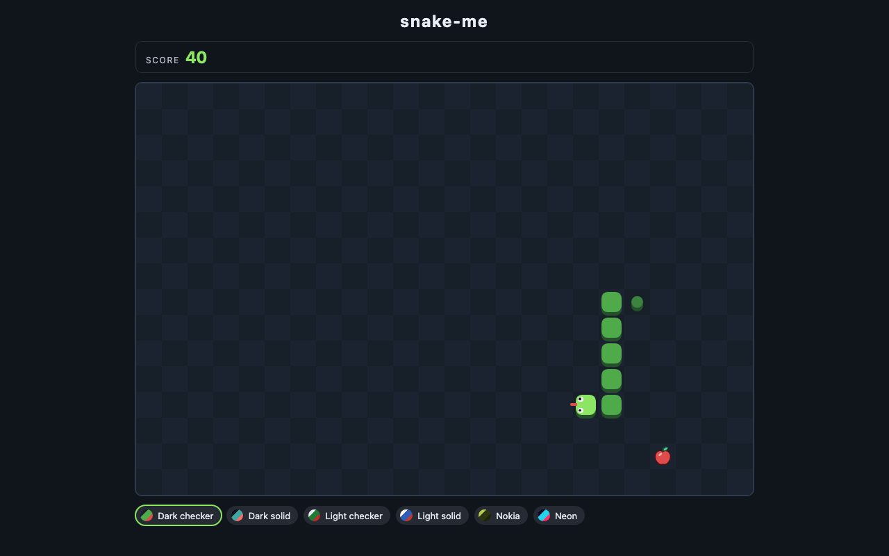
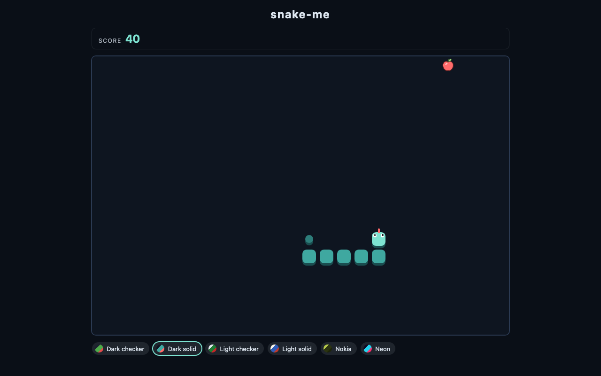
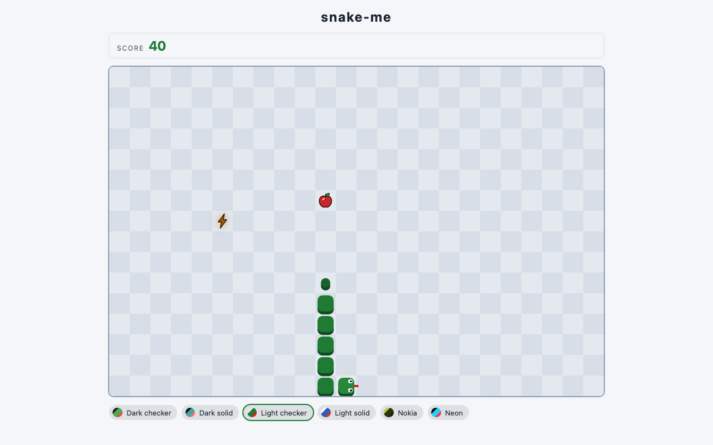
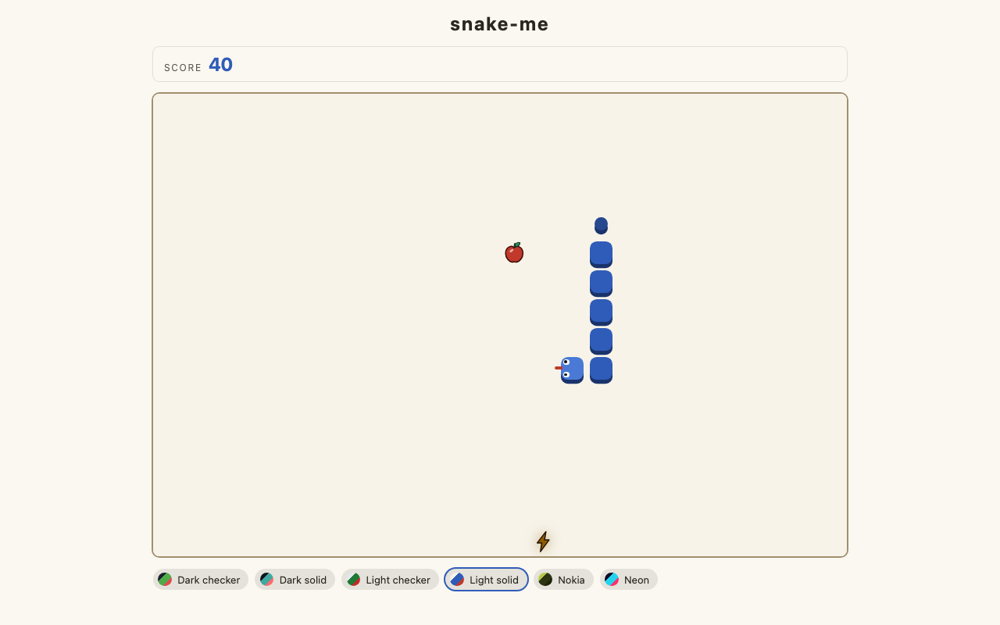
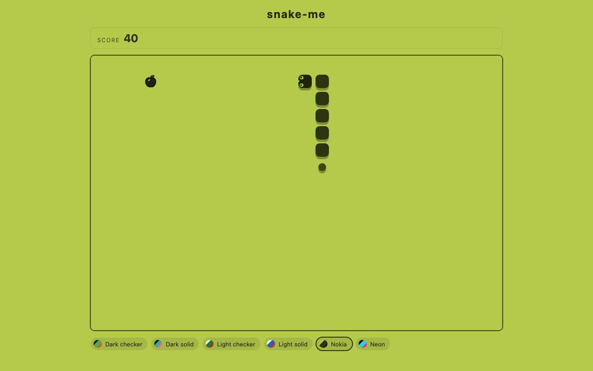
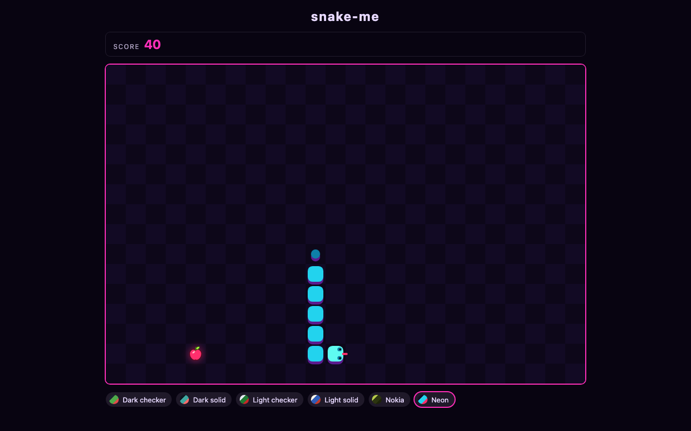

# snake-me

[](https://github.com/LiorBraginsky/snake-me/actions/workflows/ci.yml)

Classic snake, built as a portfolio piece — **[play it here](https://liorbraginsky.github.io/snake-me/)**.



## What this is

The game is the demo. The point is everything around it.

`snake-me` is a small, finished product used to show how I like to build software:
a pure deterministic domain core with no framework in it, dependencies that only
ever point one way, and every architectural rule expressed as a command that fails
rather than a paragraph that gets ignored. It is ~1,900 lines of production
TypeScript across five layers, backed by ~2,300 lines of tests — 138 of them,
plus one end-to-end smoke — and zero `eslint-disable` comments in the tree.

It was also built by an agentic delivery pipeline — six chunks, six pull requests,
each one planned, implemented, reviewed and merged by orchestrated agents against
gates they could not talk their way past. [How it was built](#how-it-was-built) is
the section for that.

**Stack:** Solid.js · TypeScript (strict) · Vite · Vitest · Playwright · GitHub
Pages. No backend, no accounts, no canvas — DOM and CSS custom properties, on
purpose.

## Play it

| Key | Action |
|---|---|
| `←` `↑` `→` `↓` or `W` `A` `S` `D` | steer |
| `Space` | start / play again |
| `P` or `Esc` | pause |

A 24×16 landscape board. Apples score, the snake grows, walls and your own body
end the round. Occasionally an apple leaves a lightning bolt behind: pick it up
for a temporary speed-up worth extra points, or let it expire. Your best five
scores and your chosen theme survive a reload. Every number behind those
sentences — board size, tick interval, boost odds, duration and payout — is a
named constant in [`src/entities/game/rules.ts`](src/entities/game/rules.ts) and
appears nowhere else in production code — the only other copy is the golden test
that pins it.

## Architecture

Trimmed [Feature-Sliced Design](https://feature-sliced.design/): five layers,
imports strictly downward.

```
app       composition — assembles widgets, owns the session, boots the theme
  │
widgets   composed UI blocks — one component per file
  │
features  reactive behaviour — session, game loop, theming, scoreboard
  │
entities  domain — the pure game core
  │
shared    framework-agnostic ports & adapters — input, storage
```

Four invariants hold this shape. None of them is a convention:

| Invariant | Enforced by |
|---|---|
| Imports point **down** only — never up, never sideways between slices | `pnpm lint` |
| A slice is reached only through its `index.ts` — no deep imports | `pnpm lint` |
| `entities/game` imports **nothing** — not the DOM, not Solid, not an npm package | `pnpm lint` |
| Every file under `src/` belongs to a slice — a homeless module is an error | `pnpm lint` |

The full map, including the frozen CSS custom-property contract and the traps
that make each rule real, lives in [`docs/architecture.md`](docs/architecture.md).
The reasoning behind the decisions is frozen in [`docs/adr/`](docs/adr/).

## Patterns on display

**A domain core that imports nothing.**
[`entities/game`](src/entities/game/) is a pure reducer —
`createInitialState`, `turn`, `tick`, `restart` — with no DOM, no clock and no
`Math.random()`. Randomness arrives as an injected `Rng` port, so a test seeds it
and gets the same round every time. The lint config gives that layer *no*
allow-policy at all, so the purity rule is a build failure rather than a promise.

**Ambient capabilities are ports, not globals.**
The game loop takes a `FrameScheduler` and the keyboard adapter takes a
`KeyDownTarget` — both structural subsets of `Window`, so production wiring is
literally `window`, no adapter module and no extra slice, while tests drive time
by passing numbers to a fake. Storage takes a *lazy* `WebStorage` provider
instead, because reading the `localStorage` property itself throws when storage
is blocked. A second lint rule bans `window`, `document`, `Date`, `setTimeout`,
`localStorage` and nine more identifiers inside those slices, and it is written
to survive a type-cast laundering attempt. The result: the whole test suite runs under Node
with no jsdom and no fake timers.

**A green gate is not evidence that the gate ran.**
This repo's most useful habit. The boundaries rule shipped as a silent no-op
twice in chunk 01 — the resolver did not know about `.ts` files, so it classified
every import as unknown and fired on nothing, while printing green. Every
architectural rule here has therefore been proven with a *deliberate violation*
that was shown to fail before the rule was trusted, and any edit to those rules
has to repeat the proof.
[`docs/architecture.md` § Trap](docs/architecture.md#trap-four-things-make-the-boundaries-gate-real)
catalogues the four settings that each silently delete part of the architecture
if removed.

**Theming is 14 CSS custom properties and one crossing point.**
Six themes live in a typed registry; a single function writes their tokens onto
`:root` and nothing else in the tree reads a colour value in JavaScript.
Components consume `var(--token)`. The camelCase→kebab-case emit contract is not
prose either — a test asserts the exact fourteen names, after review found five
mutations of that function surviving all four gates.

**A tick cannot repaint the board.**
The checkerboard is one gradient element that no game state ever reaches, so a
tick has nothing to invalidate. The engine preserves each surviving segment's
object identity, so a reference-keyed list inserts one row and removes one — the
interior is never touched — and movement writes only two coordinate custom
properties while the `transform` that consumes them stays in CSS. The end-to-end
smoke asserts the first of those mechanisms directly: from before the round
starts until the first apple is eaten, a `MutationObserver` on the board layer
must record **zero** mutations, a second observer on the entity layer must record
many, and the board node must still be the node the observer was attached to. All
three parts carry weight — a probe that sees nothing everywhere proves nothing,
and an observer whose node was swapped out underneath it reports zero forever.

**Tests are logic tests, deliberately.**
No render, markup or snapshot tests: engine golden tests, storage fallback paths,
session semantics. UI correctness is carried instead by one Playwright smoke and
a human demo, and the smoke plays the *real* game — production seeds its RNG from
`Date.now()`, so the test reads the apple's and the snake's board coordinates out
of the DOM and steers toward the apple with real arrow keys until the score
grows. No seeded-test hatch was added to production to make it easier.

## Quality gates

Every pull request runs all five. Branch protection requires them; PRs
auto-merge on green.

| Command | Enforces |
|---|---|
| `pnpm typecheck` | TypeScript strict; theme-token completeness |
| `pnpm lint` | ESLint + `eslint-plugin-boundaries` (the four invariants above) + Prettier, at `--max-warnings=0` |
| `pnpm test` | 138 logic tests under Vitest, `environment: 'node'` |
| `pnpm build` | Vite production build — the whole game ships in ~29 kB of JS and ~8 kB of CSS, about 13 kB gzipped |
| `pnpm test:e2e` | One Chromium Playwright smoke: load → start → the snake moves → the score grows |

## Themes

Six themes, each a palette plus a board style. Your pick persists across reloads.

| | |
|---|---|
| <br>**Dark checker** | <br>**Dark solid** |
| <br>**Light checker** | <br>**Light solid** |
| <br>**Nokia** | <br>**Neon** |

Contrast was computed, not eyeballed: a review round measured every theme's
snake-on-board and text pairs and fixed the seven that failed.

## Run it locally

Node 22+ and pnpm.

```bash
pnpm install
pnpm dev
```

To run the gates:

```bash
pnpm typecheck
pnpm lint
pnpm test
pnpm build

pnpm exec playwright install chromium   # once (add --with-deps on Linux)
pnpm test:e2e
```

`pnpm test:e2e` builds the app and serves it under Vite's `base` path before
running, so it works from a clean checkout.

## How it was built

Every line of this repo was produced by an agentic pipeline, and the pipeline is
as much the artifact as the game is.

The design spec was written first and ratified, then cut into **six chunks** —
walking skeleton, game core, input/session/loop, game stage UI, theming and
storage, and this closeout. Each chunk is a written contract: what is in scope,
what is explicitly out *and why*, and done-criteria tagged either **mechanical**
(proven by command output) or **behavioral** (proven by a live demo or a passing
end-to-end test). Asserting that something works is not evidence; the command
output is.

Each chunk ran as one orchestrated session — an architect produced a plan, workers
implemented it step by step, a reviewer read the diff against the architecture
docs, and fix rounds ran until the review came back clean. One chunk is one pull
request is one squashed commit on `main`, auto-merged once CI is green and never
before.

Two rules kept the documentation from rotting:

- **A technical rule that recurs becomes a lint rule, not a paragraph.** That is
  where the boundaries config and the headless-globals rule came from.
- **An architectural decision that gets made becomes an ADR** in
  [`docs/adr/`](docs/adr/), proposed by the agent and ratified by me.

The reviews earned their place. Chunk 02 shipped a green 62-test suite that a
review found nine surviving mutants in — a snake that could pass through the top
wall, an apple that could spawn under the snake — all killed and re-verified.
Chunk 05 found five mutations of the theme-token emitter surviving all four
gates, including one that voided the entire naming contract, and closed the hole
with an executable test. Chunk 05's widening of the headless-globals rule was probed
with a deliberate violation in both directions — a banned global inside a newly
covered slice, and the same probe inside the slice deliberately left out — before
it was believed.

## Repo layout

```
src/
  app/        composition root, styles, the CSS cascade
  widgets/    game-stage, hud, theme-picker
  features/   game-session, theming, scoreboard
  entities/   game — the pure core
  shared/     input, storage
e2e/          the one Playwright smoke
test/         the cross-slice contract tests
docs/
  architecture.md   the living map
  adr/              frozen decisions
  specs/            the design spec
```
